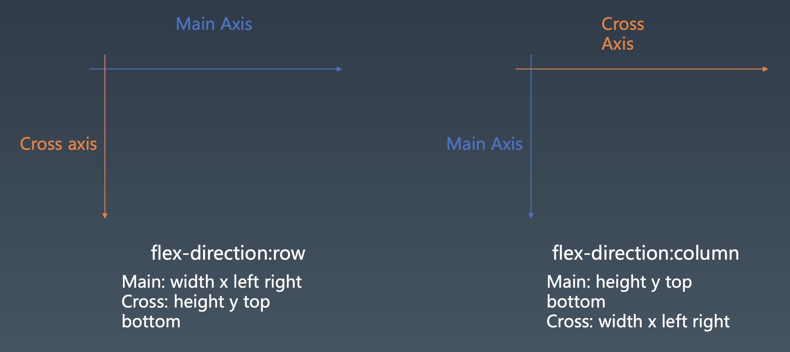
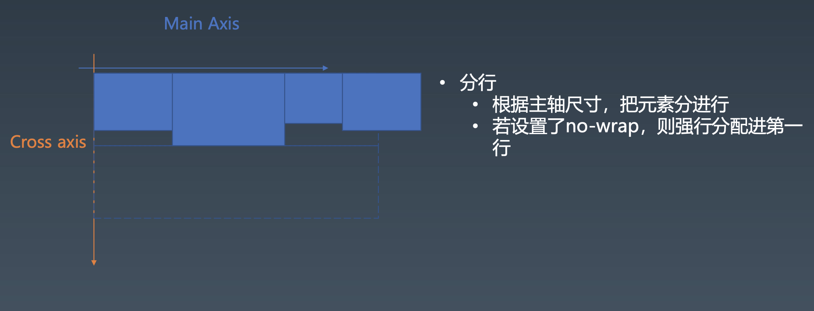
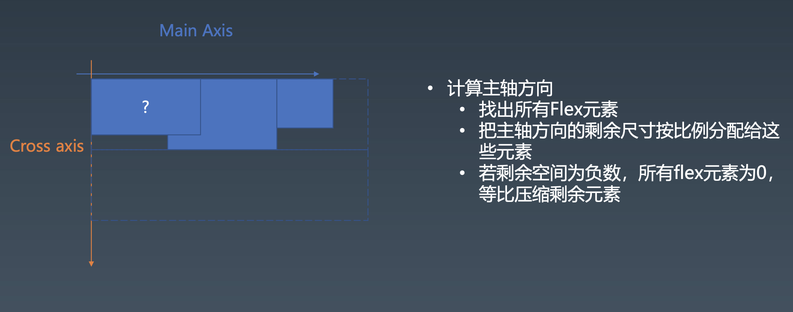
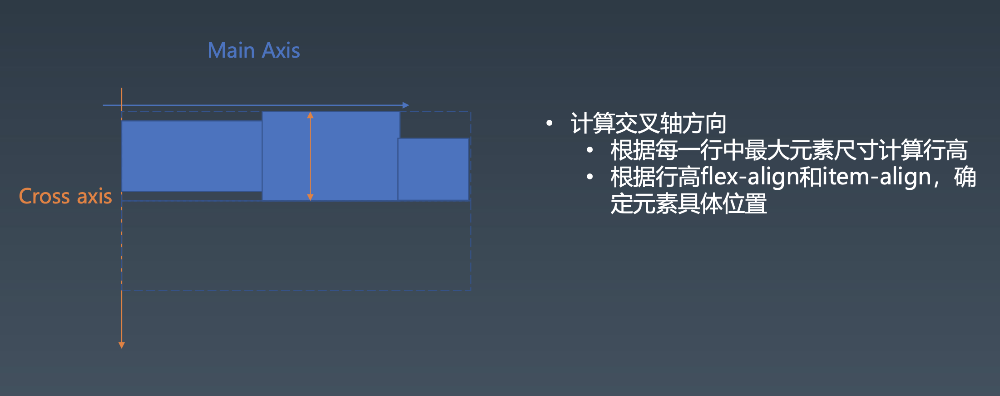

第5周学习笔记

# 浏览器的工作原理

## css parser环境准备

```
npm i css   // css parser
```
1、收集css规则
- 遇到style标签时，我们把CSS规则保存起来
- 这里我们调用CSS Parser来分析CSS规则
- 这里我们必须要仔细研究此库分析CSS规则的格式

2、添加调用
- 当我们创建一个元素后，立即计算CSS
- 理论上，当我们分析一个元素时，所有CSS规则已经收集完毕
- 在真实浏览器中，可能遇到写在body的style标签，需要重新 CSS计算的情况，这里我们忽略

3、获取父元素序列
- 在computeCSS函数中，我们必须知道元素的所有父元素才能判断元素与规则是否匹配
- 我们从上一步骤的stack，可以获取本元素所有的父元素
- 因为我们首先获取的是“当前元素”，所以我们获得和计算父元素匹配的顺序是从内向外

4、拆分选择器
- 选择器也要从当前元素向外排列
- 复杂选择器拆成针对单个元素的选择器，用循环匹配父元素队列

5、计算选择器与元素匹配
- 根据选择器的类型和元素属性，计算是否与当前元素匹配
- 这里仅仅实现了三种基本选择器，实际的浏览器中要处理复合选
择器

6、生成computed属性
- 一旦选择匹配，就应用选择器到元素上，形成computedStyle

7、确定规则覆盖关系
- priority:优先级，specificity：特征、专一性
- CSS规则根据specificity和后来优先规则覆盖
- specificity是个四元组，越左边权重越高

```javascript
[0,        0,        0,     0]
inline, > id,  >  class, > tag

eg:
div div #id : [0,1,0,2]
div #id : [0,1,0,1]
div .class #id : [0,1,1,1]
```

- 一个CSS规则的specificity根据包含的简单选择器相加而成


## 排版layout

1、根据浏览器属性进行排版



2、收集元素进行(hang)



3、计算主轴



3、计算交叉轴



## 绘制

1、绘制单个元素

- 绘制需要依赖一个图形环境
- 我们这里采用了npm包images 
- 绘制在一个viewport上进行
- 与绘制相关的属性:background-color、border、 background-image等

2、绘制DOM

- 递归调用子元素的绘制方法完成DOM树的绘制
- 忽略一些不需要绘制的节点
- 实际浏览器中，文字绘制是难点，需要依赖字体库，我们这里忽略
- 实际浏览器中，还会对一些图层做compositing，我们这里也忽略了


