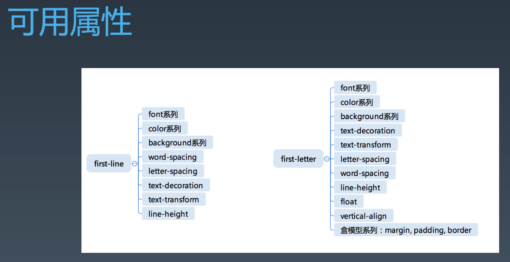

学习笔记

# 重学CSS
## CSS语法的研究
###  CSS2.1的语法
- https://www.w3.org/TR/CSS21/grammar.html#q25.0 
- https://www.w3.org/TR/css-syntax-3
  
###  CSS总体结构
- @charset
- @import
- rules
    * @media
    * @page 
    * rule

## CSS @规则的研究
###  At-rules
- @charset : https://www.w3.org/TR/css-syntax-3/
- @import :https://www.w3.org/TR/css-cascade-4/
- @media :https://www.w3.org/TR/css3-conditional/
- @page : https://www.w3.org/TR/css-page-3/
- @counter-style :https://www.w3.org/TR/css-counter-styles-3 
-  @keyframes :https://www.w3.org/TR/css-animations-1/
- @fontface :https://www.w3.org/TR/css-fonts-3/
- @supports :https://www.w3.org/TR/css3-conditional/
- @namespace :https://www.w3.org/TR/css-namespaces-3/

##  CSS规则的结构
###  CSS规则
- Selector
    * https://www.w3.org/TR/selectors-3/ 
    * https://www.w3.org/TR/selectors-4/
- Key
    * Properties
    * Variables: https://www.w3.org/TR/css-variables/
- Value
    * https://www.w3.org/TR/css-values-4/

###  选择器语法

 - 简单选择器 
    * \*
    * div svg|a, |是命名空间符，选中svg里面的a标签
    * .cls
    * #id
    * [attr=value]，理论上可以代替id和class选择器     
    * :hover
    * ::before

- 复合选择器
  * <简单选择器><简单选择器><简单选择器> 
  * \* 或者 div 必须写在最前面,伪类伪元素要写在最后面
- 复杂选择器
    * <复合选择器><sp><复合选择器>，用空格分隔就是子孙选择器
    * <复合选择器>">"<复合选择器>，父子选择器
    * <复合选择器>"~"<复合选择器>
    * <复合选择器>"+"<复合选择器>
    * <复合选择器>"||"<复合选择器>，表格里表示选中某一个列

### 优先级
优先级关系：内联样式 > ID 选择器 > 类选择器 = 属性选择器 = 伪类选择器 > 标签选择器 = 伪元素选择器

 通配选择符（universal selector）（*）关系选择符（combinators）（+, >, ~, ' ', ||）和 否定伪类（negation pseudo-class）（:not()）对优先级没有影响。（但是，在 :not() 内部声明的选择器会影响优先级）。

###  伪类

- 链接/行为 
    * :any-link
    * :link :visited     
    * :hover
    * :active
    * :focus
    * :target

- 树结构
    * :empty
    * :nth-child()
    * :nth-last-child()
    * :first-child :last-child :only-child

- 逻辑型
    * :not伪类
    * :where :has

###  伪元素
  
- ::before
- ::after
- ::first-line
- ::first-letter

## 思考：为什么first-letter可以设置float之类的，而first-line不行呢?

我认为first-letter可用设置float之类的是因为针对的就是一个字母，内容是固定的，而first-line是针对一行，一行的内容不固定，在不同的尺寸的屏幕上一行的内容也是不一样的。针对不固定的内容，浏览器去解析的时候是很难判断的。
