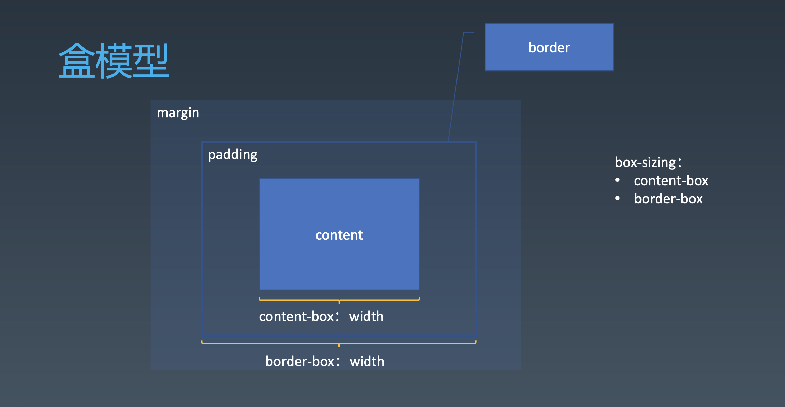

学习笔记

# 重学CSS(排版)

## 盒（Box）

- HTML代码中可以书写开始**标签**，结束**标签**，和自封闭**标签**。
- 一对起止**标签**，表示一个**元素**。 
- DOM树中存储的是**元素**和其它类型的**节点(Node)**。 
- CSS选择器选中的是**元素**。 
- CSS选择器选中的**元素或者伪元素**，在排版时可能产生多个**盒**。 
- 排版和渲染的**基本单位是盒**。

### 盒模型

- box-sizing
  * content-box:宽度只包含content
  * border-box:宽度包含：content、padding、border

## 排版技术
- 正常流
- flex
- grid
- CSS Houdini

### 正常流

- 收集盒进行
- 计算盒在行中的排布 
- 计算行的排布

### BFC
只有同一个BFC才会发生margin折叠的现象，其他排版不会出现
#### Block
- Block Container:里面有BFC的
    * block
    * inline-block
    * table-cell
    * flex item
    * grid cell
    * table-caption
- Block-level Box:外面有BFC的
  * Block Level
    + display:block 
    + display: flex
    + display: table 
    + display: grid
    + ......
  * Inline Level
    + display: inline-block 
    + display: inline-flex
    + display: inline-table 
    + display: inline-grid
    + ......
  * display:run-in:跟着上一个元素，有时block level有时inline level
- Block Box = Block Container + Block-level Box: 里外都有BFC的

#### 设立BFC
- floats
- absolutely positioned elements
- block containers (such as inline-blocks, table-cells, and table-captions) that are not block boxes,
    * flex items 
    * grid cell
    * ......
- and block boxes with 'overflow' other than 'visible'

#### BFC合并
- block box && overflow:visible 
  * BFC合并与float
  * BFC合并与边距折叠

### flex
- 收集盒进行
- 计算盒在主轴方向的排布
- 计算盒在交叉轴方向的排布

## Animation
- @keyframes定义
- animation：使用

- 属性
  * animation-name 时间曲线
  * animation-duration 动画的时长;
  * animation-timing-function 动画的时间曲线;   
  * animation-delay 动画开始前的延迟;
  * animation-iteration-count 动画的播放次数;   
  * animation-direction 动画的方向。

## Transition

- transition-property 要变换的属性;
- transition-duration 变换的时长;
- transition-timing-function 时间曲线; 
- transition-delay 延迟。

 ## 绘制
- 几何图形 
  * border
  * box-shadow
  * border-radius
- 文字
  * font
  * text-decoration
- 位图
  * background-image

