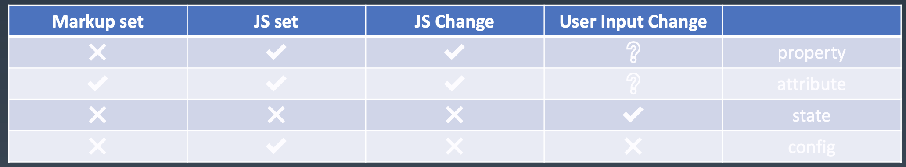
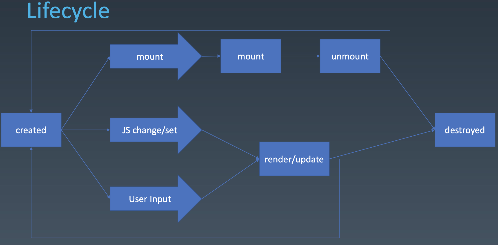

学习笔记
# 组件化

## 对象与组件
-  对象
    * Properties，属性
    * Methods，方法
    * Inherit，继承

- 组件，跟UI强相关
    * Properties，属性，强调从属关系
    * Methods，方法
    * Inherit，继承
    * Attribute，特性，强调描述性
    * Config & State，相似相通，用户操作影响state
    * Event，事件
    * Lifecycle，生命周期
    * Children

##  如何设计组件状态

## 组件的生命周期

## 总结

遇到个问题就是直接用webpack-dev-server直接启动项目，通过localhost访问，只是每次修改了代码，webpack-dev-server显示编译成功，但是浏览器上刷新了也没有变化。后面全局安装了webpack，然后刷新一下浏览器好像就可以了。为啥一开始webpack要全局安装，后面又要在项目里单独安装呢？
