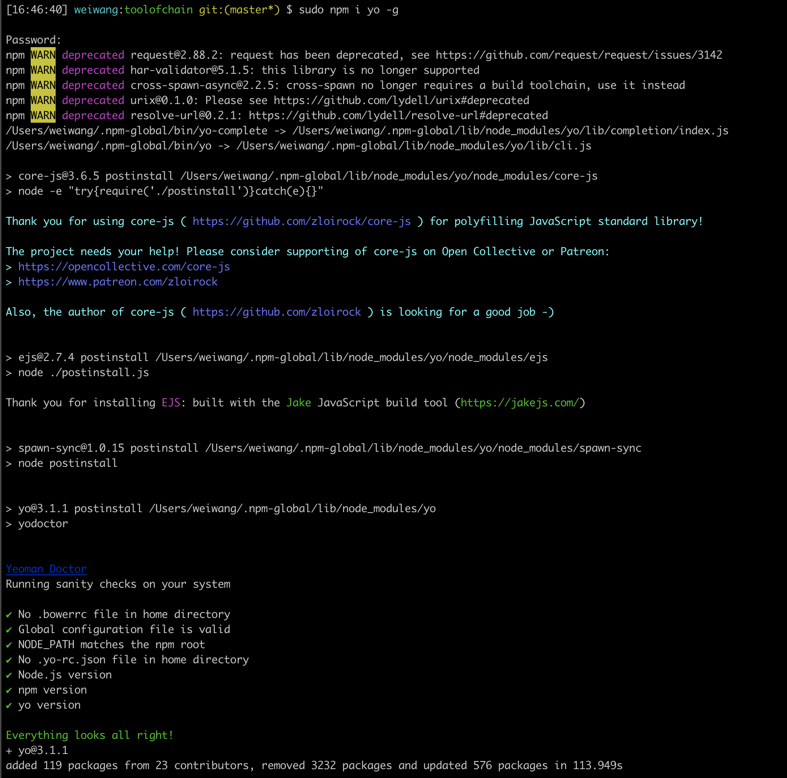

学习笔记
## npm link 报错

```javascript
npm link
sudo npm link

```


## 解决npm link 报错办法

```javascript
sudo npm link 模块名
```


[参考链接](https://www.cnblogs.com/mengff/p/11743145.html)


## npm i yeoman-generator -g 报错

```
npm i yeoman-generator -g
```


## 解决npm i yeoman-generator -g 报错办法

**先清除缓存，再重新安装**
```
npm cache clean --force

npm i yeoman-generator -g

```


## 解决zsh: command not found: yo

**全局安装yo**

```
sudo npm i yo -g

```


## 解决yo toolofchain报错Cannot find module 'yeoman-generator'的时候

**删掉node_modules,然后重新sudo npm i即可**


