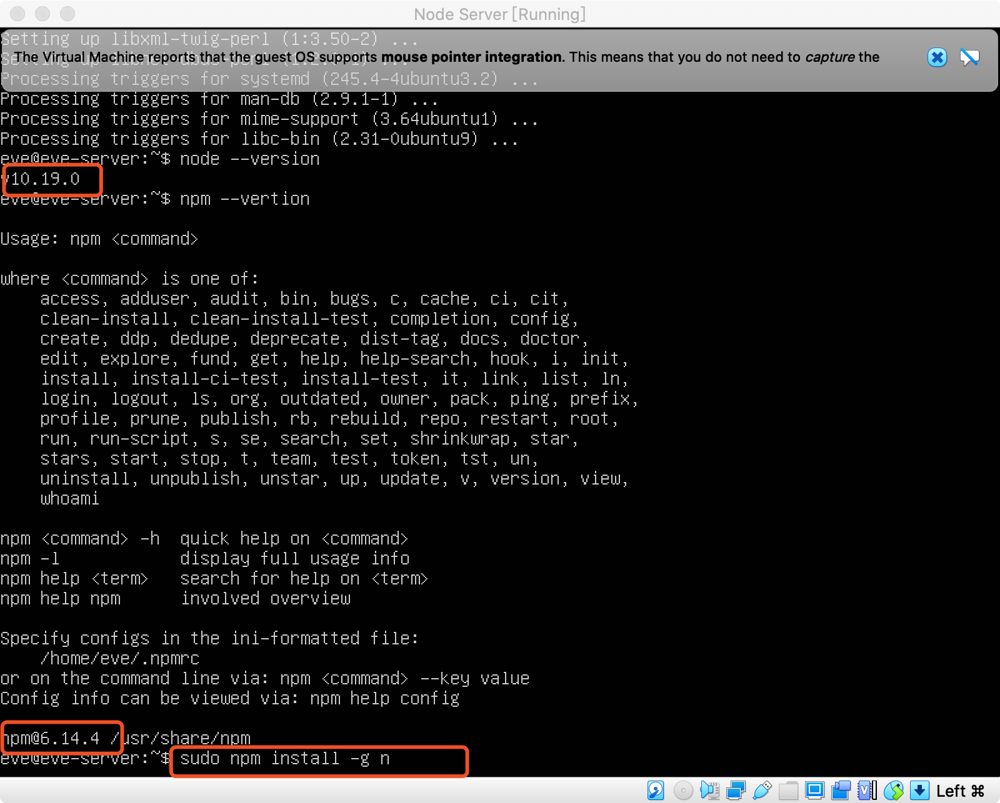
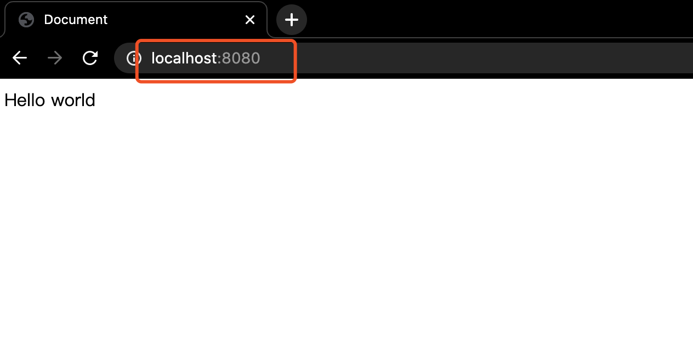

学习笔记

## 实现线上Web服务

- 下载安装VM Box, Ubuntu 镜像
- 新建一个Node Server（Linux，Ubuntu-64bit）
- 启动Node Server的时候引入Ubuntu 镜像
- Ubuntu 镜像启动后需要更改镜像地址


- 填写用户名和服务器名，密码


- 勾选Install OpenSSH server


- 安装完毕，点击Reboot重启


- 手动重启


- 输入用户名和密码登录成功


- 用apt安装nodejs
```
sudo apt install nodejs
```


- 用apt安装npm
```
sudo apt install npm
```


- 用npm 全局安装 n
  
  用node 写的node版本管理
```
sudo npm install -g n
```



- 用 n 来管理node版本
  要最新的node


- PATH=$"PATH"

- 在本地创建server文件夹，然后用express快速搭建一个服务器

```javascript

mkdir server
cd server
npx express-generator // 要是经常初始化项目，可以全局安装 npm install -g express-generator
npm install
npm start //默认3000端口
```

- 在虚拟机上启动ssh
  
```
service ssh start
```
默认22端口
  


- 虚拟机设置22端口(PS:只有虚拟机用户才需要配置端口，正常的机器不需要)


- 用scp命令

把本地目录的所有文件从8022 端口copy到虚拟机上
P后面跟端口号
127.0.0.1 如果是真的服务器，就用服务器的ip地址就可以了

因为copy整个目录，所以加个-r
```
scp -P 8022 -r ./* eve@127.0.0.1:/home/eve/server
```


虚拟机上创建完目录再在本地试一次，这次成功了，可以看到虚拟机上的文件，这个时候不需要在虚拟机上npm install ，只要虚拟机上的node modules 和本地的保持一致即可


- 在虚拟机上执行npm start
这个时候监听的是3000端口，所以还是要添加新的端口映射


- 添加新的端口映射(PS:只有虚拟机用户才需要配置端口，正常的机器不需要)


这个时候可以在浏览器看到


然后虚拟机上的效果


- 访问一下style.css也可以看到


## 实现一个发布系统

在本地新建两个文件夹publish-tool和publish-server,然后全都先npm init一下,然后再各新建publish.js和erver.js文件

```javascript
mkdir publish-tool
cd publish-tool
npm init
touch publish.js

mkdir publish-server
cd publish-tool
npm init
touch server.js

```
- publish.js的代码

```javascript

let http = require('http');

let fs = require("fs");

    let request = http.request({
        hostname:"127.0.0.1",
        port:8082,
        method: "POST",
        headers:{
            'Content-Type':'application/octet-stream', // 流式传输的类型
        }
    }, response => {
        console.log(response);
        
    })
    
    let file = fs.createReadStream("./package.json");


file.on('data', chunk => {
    console.log(chunk.toString());
    request.write(chunk);
})
file.on('end', chunk => {
    console.log("read finished");
    request.end(chunk);
})

```


- server.js 的代码
  
```javascript
let http = require('http');
let fs = require('fs');

http.createServer((req, res) => {
    console.log(req.headers);

    req.on('data', chunk => {
        console.log(chunk);

    })
    req.on('end', chunk => {
        res.end('success');
    })
}).listen(8082);

```

- 用vscode分别打开着两个文件，然后点击左边的debug按钮
  * 先监听server.js,下图是运行完publish才会收到结果
  

  * 再运行publish.js
  


- 修改一下两个文件的代码

```javascript
// publish.js
let http = require('http');

let fs = require("fs");

    let request = http.request({
        hostname:"127.0.0.1",
        port:8082,
        method: "POST",
        headers:{
            'Content-Type':'application/octet-stream', // 流式传输的类型
          
        }
    }, response => {
        console.log(response);
        
    })
    
    let file = fs.createReadStream("./sample/sample.html"); // 记得新建sample.html
 


file.on('data', chunk => {
    console.log(chunk.toString());
    request.write(chunk);
})
file.on('end', chunk => {
    console.log("read finished");
    request.end(chunk);
})

```

```javascript
// server.js
let http = require('http');
let fs = require('fs');

http.createServer((req, res) => {
    console.log(req.headers);

    let outFile = fs.createWriteStream("../server/public/index.html") // 我的server文件夹和publish-tool、publish-server是在同一个路径下

    req.on('data', chunk => {
        console.log(chunk);
        outFile.write(chunk);

    })
    req.on('end', chunk => {
        outFile.end();
        res.end('success');
    })
}).listen(8082);
```

```html
<!-- sample.html -->
<!DOCTYPE html>
<html lang="en">
<head>
    <meta charset="UTF-8">
    <meta name="viewport" content="width=device-width, initial-scale=1.0">
    <title>Hello</title>
</head>
<body>
    <h1>Hello333</h1>
</body>
</html>

```

- 然后继续监听publish-server,运行publish-tool,只要没有报错即可，然后你再进入到之前的server文件夹里，启动server，然后在浏览器打开3000端口，这个时候可以看到原来的index.html被sample.html覆盖了
```javascript

cd server
npm start //默认3000端口
```


- 发布系统

因为总是要发布，所以命令可以统一写在package.json里的script


其他文件也是这样写，只是后面的文件名不一致

- 服务器上启动多个服务

```
npm start&
```


- publish-server 用的端口8022，所以还是要设置端口转发(PS:只有虚拟机用户才需要配置端口，正常的机器不需要)


这个时候代码里改一下publish.js的端口


- 然后本地运行publish.js
 

- 在浏览器打开8080端口可以看到Hello333,这个时候就是模拟了本地访问线上的服务器
 

## 单文件发布

```javascript
// publish.js

let http = require('http');

let fs = require("fs");


fs.stat('./sample/sample.html', (err, stats) => { // 单文件场景

    let request = http.request({
        hostname:"127.0.0.1",
        port:8082,
        // port:8882,
        method: "POST",
        headers:{
            'Content-Type':'application/octet-stream', // 流式传输的类型
            'Conten-Length':stats.size,
        }
    }, response => {
        console.log(response);
        
    })
    
    let file = fs.createReadStream("./sample/sample.html");

    
    file.pipe(request);
    
    file.on('end', () => request.end());
})
```

```javascript
// server.js
let http = require('http');
let fs = require('fs');

http.createServer((req, res) => {
    console.log('req');
    let outFile = fs.createWriteStream("../server/public/index.html")
    req.pipe(outFile);
}).listen(8082);

```

可以修改一下sample.html,然后再启动监听server服务，运行publish.js之后，在浏览器看3000端口内容是否跟sample.html内容一致

## 多文件发布

新增一张图片和sample.html放在一起

- 在publish-tool安装archiver压缩

```javascript
npm install --save archiver
```


- publish.js的代码修改
```javascript

let http = require('http');

let fs = require("fs");

let archiver = require("archiver");

    let request = http.request({
        hostname:"127.0.0.1",
        port:8082,
        // port:8882,
        method: "POST",
        headers:{
            'Content-Type':'application/octet-stream', // 流式传输的类型
            // 'Conten-Length':stats.size,
        }
    }, response => {
        console.log(response);
        
    })
    

     // 创建archiver实例
    const  archive = archiver('zip', {
        zlib:{level:9}
    })

    archive.directory('./sample/', false);

    archive.finalize(); // 填好压缩内容
    archive.pipe(fs.createWriteStream("tmp.zip")
     archive.pipe(request);

    
```
然后直接运行publish.js,可以看到当前文件下的tmp.zip压缩文件


- server.js文件修改
```javascript
let http = require('http');
let fs = require('fs');

http.createServer((req, res) => {
    console.log('req');

    let outFile = fs.createWriteStream("../server/public/tmp.zip")
    req.pipe(outFile);
}).listen(8082);
```
然后重新运行一次publish.js文件，就可以在server/public/路径下看到tmp.zip压缩文件了


- 在服务端进行解压
sudo npm install --save unzipper
```javascript
sudo npm install --save unzipper
```


- server.js解压代码修改

```javascript
let http = require('http');
let unzipper = require('unzipper');

http.createServer((req, res) => {
    console.log('req');

    req.pipe(unzipper.Extract({path:'../server/public/'}));
}).listen(8082);
```
然后再重新启动publish.js这样就可以在server文件夹里看到解压后的文件了


## 总结


